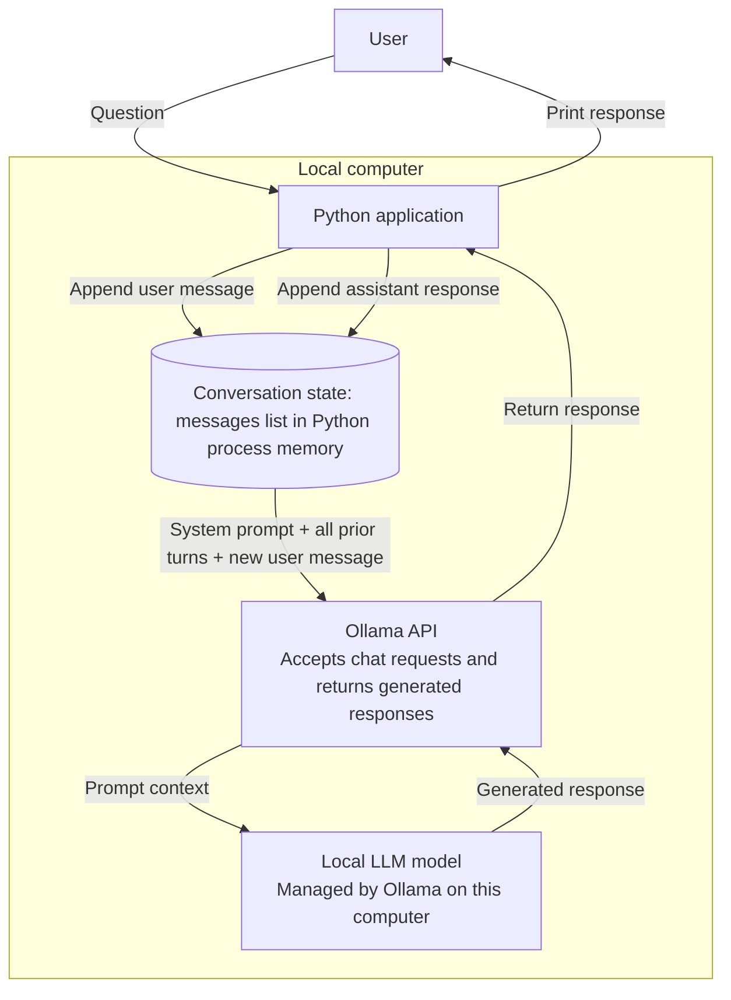

# DevMentor

## Description

DevMentor is a command-line programming tutor for beginner developers. It uses a locally hosted Ollama model to answer questions, and sends the current conversation history with each request so responses can use earlier turns.

## Features

- Ask programming questions in an interactive chat.
- Keep user and assistant messages in conversation history for the current run.
- Use `/history` to display the conversation without the system prompt.
- Use `/reset` to clear the conversation while retaining the system prompt.
- Use `/exit` to end the chat. `exit` and `quit` are also accepted.
- Handle blank input, connection failures, and missing models with user-facing messages.

## Architecture

The Python application owns conversation state and communicates with the local Ollama service. Ollama handles the chat API request and runs the configured model on the same computer.



## Installation

Prerequisites: Python 3.10 or later, `pip`, and the Ollama application. Install Ollama separately and ensure the configured model is available.

From the repository root, create and activate a virtual environment, install the DevMentor dependencies, and download the default model:

```powershell
python -m venv .venv
.\.venv\Scripts\Activate.ps1
python -m pip install --upgrade pip
python -m pip install -r devmentor\requirements.txt
ollama pull llama3.2
```

On macOS or Linux, activate the environment with `source .venv/bin/activate`.

## Running the Application

Make sure the Ollama service is running. If it is not already running, start it in a separate terminal:

```powershell
ollama serve
```

From the repository root, launch DevMentor:

```powershell
python devmentor\main.py
```

Enter a question at the `You:` prompt. Enter `/history` to view turns, `/reset` to start a fresh conversation, or `/exit` to quit.

## System Prompt Design

The system prompt is defined in `prompts.py`. It sets DevMentor's role as a programming tutor and asks it to explain clearly, use real-world examples, encourage best practices, adapt to the learner, provide constructive feedback and code examples, explain before showing code, acknowledge uncertainty, and encourage curiosity. The prompt guides the model's response style; it does not guarantee that every answer or code example is correct.

## Prompt Engineering Experiment

Use the same model and user question for all three runs. Change only the system prompt so the comparison is fair.

**Test question:** Explain REST APIs. Explain recursion. What is dependency injection? Show me an example.

**A — Minimal system prompt:**

```text
You are a programming assistant.

```

**B — Detailed system prompt:**

```text
You are DevMentor helping beginner programmers.
Explain concepts clearly with examples.

```

**C — Constrained system prompt:**

```text
You are DevMentor.
Explain before code.
Keep answers concise.
Use beginner-friendly examples.
Mention uncertainty when unsure.

```

| Prompt | Response summary | Clarity | Conciseness | Beginner-friendly? |
|---|---|---|---|---|
| A — Minimal | Formal explanations with several HTTP examples and a factorial example; REST was expanded incorrectly. | Medium | Medium | Medium |
| B — Detailed | Uses a restaurant analogy for REST and nesting dolls for recursion; the dependency-injection example fails when its factory calls the redefined constructor. | Medium | Low | High |
| C — Constrained | Shorter REST explanation and beginner analogies, but the full answer remains long and adds an awkward uncertainty question. | Medium | Medium | Medium |

### Reflection

1. **Which prompt was most useful, and why?** B was the most beginner-friendly: the restaurant analogy for REST APIs and nesting-doll analogy for recursion make the ideas approachable. However, its dependency-injection example is inconsistent: the factory constructs `DatabaseConnector` with too few arguments, so the example would not run as shown.
2. **What differences did you see?** A gave formal definitions, a numbered explanation of recursion, and several HTTP examples, but expanded REST incorrectly as “Representational State of Resource.” B used more analogies and a warmer, step-by-step tone. C was more concise in its REST section, but still gave a long dependency-injection explanation and repeated the inconsistent example. All three covered the same topics and included code examples.
3. **Did more instructions always help?** No. Beginner-focused instructions led to useful analogies, but the responses still contained a faulty dependency-injection example. The request to mention uncertainty in C produced an irrelevant question (“Are you sure you understand recursion?”) rather than a useful statement of uncertainty.
4. **Which rules changed behaviour the most?** The beginner-friendly instruction changed the explanations most by adding the restaurant and nesting-doll analogies. “Keep answers concise” shortened parts of C, especially its REST section, but did not keep the whole response concise. The uncertainty instruction also changed the answer, though not helpfully.

### Conclusion

With the same multi-part question, changing the system prompt changed the tone and presentation: A was more formal, B used beginner-friendly analogies, and C attempted a concise style but remained lengthy and added an unhelpful uncertainty question. B was the most approachable, but the responses also contained factual and code-example problems. The experiment shows that prompt instructions can guide style and emphasis, but do not guarantee correctness or concision; definitions and examples still need to be checked.

## Memory Investigation

After running the scripted chats the model was able to remember the information about my favourite language. Below is the response: 

>>> My favorite programming langauge is python.
Python is an excellent choice for a programming language.
It's known for its simplicity, readability, and versatility. Here are some reasons why Python is a popular choice among programmers:

1. **Easy to learn**: Python has a simple syntax and is relatively easy to learn, making it a great language for beginners.
2. **Versatile**: Python can be used for a wide range of applications, including web development, data analysis, machine learning, and more.
3. **Large community**: Python has a massive and active community, which means there are many resources available for learning and troubleshooting.
4. **Cross-platform**: Python can run on multiple operating systems, including Windows, macOS, and Linux.
5. **Extensive libraries**: Python has a vast collection of libraries and frameworks that make it easy to perform various tasks, such as data analysis, web development, and more.

Some popular uses of Python include:

1. **Data analysis**: Python is widely used for data analysis, machine learning, and data visualization.
2. **Web development**: Python is used in web development frameworks such as Django and Flask.
3. **Automation**: Python is often used for automating tasks, such as data scraping, file management, and more.
4. **Scientific computing**: Python is used in scientific computing for tasks such as numerical analysis, signal processing, and more.

What do you like most about Python? Is there a specific area where you'd like to learn more?

>>> Explain interfaces.
**Interfaces**

In programming, an interface is a contract between a client and a server that specifies the methods and data that can be used to interact with the server.

Think of an interface as a blueprint or a set of instructions that says what can be done with a particular service or system.

**Example:**

Let's say we have a bank account interface that allows us to perform the following actions:

1. Deposit money
2. Withdraw money
3. Check balance

The interface would specify the methods and data that can be used to interact with the account, such as:

`deposit(amount)`: deposit a certain amount of money into the account
`withdraw(amount)`: withdraw a certain amount of money from the account
 `get_balance()`: retrieve the current balance of the account

**Key aspects of interfaces:**

1. **Abstraction**: Interfaces abstract away the implementation details of a system or service, allowing clients to interact with it without knowing the underlying details.
2. **Contract**: Interfaces define a contract between the client and the server, specifying the methods and data that can be used to interact with the server.
3. **Standardization**: Interfaces provide a standard way for clients to interact with a server or system, making it easier to develop and maintain applications.

**Types of interfaces:**

1. **Abstract interface**: An abstract interface is a class that cannot be instantiated and provides a set of abstract methods that must be implemented by any class that inherits from it.
2. **Concrete interface**: A concrete interface is a class that implements a set of methods and provides a specific implementation for those methods.

**Importance of interfaces:**

1. **Flexibility**: Interfaces allow clients to switch between different implementations of a service or system without changing the client code.
2. **Reusability**: Interfaces enable the reusability of code by providing a standard way for clients to interact with a server or system.
3. **Maintainability**: Interfaces make it easier to maintain applications by providing a clear and standardized way of interacting with a server or system.

I hope this explanation helps! Do you have any specific
questions about interfaces or would you like me to
elaborate on any of the points I mentioned?

>>> what is my favorite programming language?
Your favorite programming language is Python

#### Findings

- **Application state:** The running Python process owns the `messages` list. `initialize_chat()` starts it with only the system prompt. It exists in memory while the program runs; the application does not save it to a file or database.
- **Message history:** Each user message and assistant response is appended to `messages`. In this run, the user's statement that Python is their favorite language remained in the list while the assistant answered the later questions about interfaces.
- **Sent context:** Every request calls `client.chat(model=MODEL_NAME, messages=messages)`, so Ollama receives the system prompt and the conversation history accumulated so far. `/history` displays the user and assistant turns, while `/reset` clears those turns and restores only the system prompt.
- **Why the LLM appears to remember:** When asked about the favorite language, the model can use the earlier statement because that statement is included in the context sent with the latest request. The intervening questions do not erase it from the application's message list.
- **Why the LLM does not actually remember:** The model does not independently retain this conversation between requests. It generates each answer from its trained parameters and the messages supplied for that request. If the program restarts or `/reset` is used, the earlier favorite-language statement is no longer sent, unless the application separately stores and reloads it.

Conversation history also consumes the model's context window. This application sends the accumulated history without trimming it, so very long conversations may eventually exceed the model's context limit.

## Challenges Questions

1. **Why does the app send previous messages to the LLM?** So each response can use relevant earlier turns, such as the user's stated favorite language.
2. **What is the difference between system, user, and assistant messages?** A `system` message gives behavior instructions, a `user` message contains the person's input, and an `assistant` message contains the model's reply.
3. **If you close Python and restart, why does the assistant “forget”?** The `messages` list exists only in the running process. Restarting creates a new list with only the system prompt.
4. **Is memory stored inside the LLM or inside your application?** In this app, conversation memory is the `messages` list held by the Python application. The model uses the context sent with each request; it does not independently save this chat.
5. **What happens when the conversation becomes extremely long? What is a context window?** A context window is the amount of text, measured in tokens, that a model can process for one request. This app sends the full history without trimming it, so a sufficiently long chat may exceed the model's limit and be truncated or rejected.
6. **Why is `You are helpful.` a weak system prompt? How would you improve it?** It does not specify the assistant's role, audience, or how to answer. For example: `You are a programming tutor for beginners. Explain concepts accurately in clear steps, define technical terms, and give a small example. State uncertainty when needed.`
7. **After the LLM replies, what should happen to `messages` before the next user turn, and why?** Append the assistant's answer so the next request contains both sides of the conversation:

	```python
	messages.append({"role": "assistant", "content": answer})
	```

	This preserves the turn order and lets the model use its own previous reply as context.

## Lessons Learned

- Conversation continuity in this application comes from resending stored messages, not persistent model memory.
- Specific instructions influence tone, examples, and structure, but do not ensure factual or executable answers.
- Use a consistent question to compare prompts, and validate definitions and code examples before relying on a response.
- Conversation history grows with every turn and can eventually exceed the model's context window.
